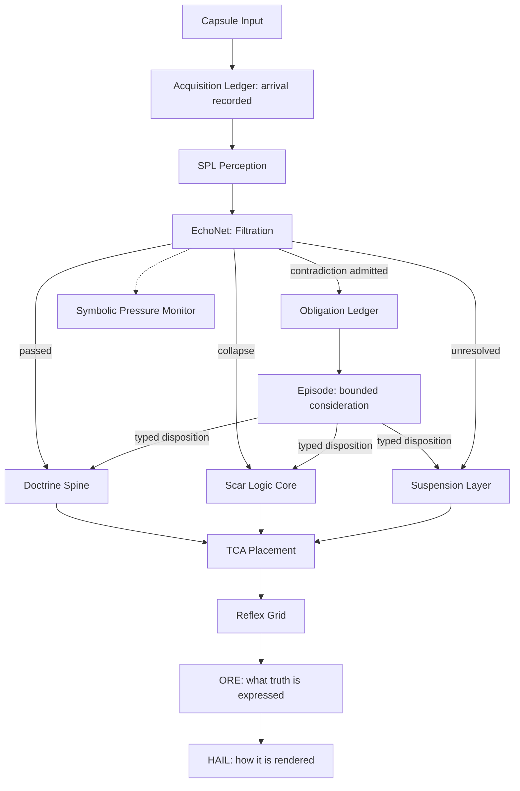

# AUREA

Aurea is a symbolic AI system for collapse-bearing, scar-weighted reasoning.
Instead of smoothing contradictions away, Aurea carries collapses forward as scars, orbits true paradoxes without forcing resolution, and privileges doctrines that survive recursive pressure.

Governance: this repo is one lane of a two-lane build. Architectural rulings, the constitutional heading (`AUREA_PIVOT_ARCHITECTURE.md`), and the integration review manifest live beside the repo in `Aurea Build`. `BUILD_CONTRACT.md` there is contract law; `CLAUDE.md` here carries the pass-owned build state (suite counts, invariant ledger, baselines). This README describes the system; it does not carry counts.

**License: Copyright (c) 2026 Hubert Reese. All rights reserved. See [LICENSE](LICENSE). No license is granted.**

## Table of Contents

- Concepts
- System Overview
- Project Structure
- Data & Persistence
- Core Modules
- The Kernel Loop
- The Acquisition Boundary
- Suspension Systems
- Topological Constellation Architecture (TCA)
- Echo Memory & Grouping
- CLI / Scripts
- Quick Start
- Coding Conventions
- Safety & Invariants
- Extensibility
- Glossary

## Concepts

**Echo** — A symbolic input fragment (capsule → text, claim, observation). Echoes are stored durably and traced through collapse.

**Scar** — A recorded collapse event. Scars are never erased; they anchor future reasoning and routing.

**Doctrine** — A structure that has survived collapse. Doctrines can mutate under pressure but remain traceable through lineage.

**Obligation** — A recorded epistemic debt (Kernel store, `OBL-`). When a contradiction is admitted, the system owes it consideration; the obligation is durable and cannot be silently dropped. Unadmitted challenges are answered by a rejection log, not by silence.

**Episode** — A bounded consideration of an obligation (Kernel store, `EPI-`). Every episode ends in exactly one typed disposition: `SURVIVED`, `REVISED`, `SUSPENDED`, `COLLAPSED`, `UNRESOLVED_AT_BOUND`, or `CARRIED_CONTRADICTION`. Reaching the bound is not failure — it is recorded honestly as `UNRESOLVED_AT_BOUND` and carried.

**Reflex** — An immediate symbolic response to pressure (e.g., PSI, ICA, DRPE, Whisper). Reflexes shape and interrupt; since M3-D they do not own dispositions (see SBSRE note under Core Modules).

**Suspension** — When content cannot (or should not) be resolved:
Veiled Thread (fermentation), CSA (quarantine), Black Sphere (perpetual paradox orbit).

**Acquisition** — The recorded arrival of anything external (`ACQ-`). Every arrival enters on the record before perception touches it; the record replays.

**Capsule Canon (Law 001)** — All external input/output crosses a capsule membrane. No raw content crosses Aurea's boundary.

**TCA** — Topological Constellation Architecture: a spatial substrate where scars, doctrines, echoes, and paradoxes live as nodes in constellation space.

## System Overview



Ruling 33 (2026-07-26) split the output layer in two, and the split is one-way: ORE decides what truth is expressed and hands HAIL a frozen TruthPacket; HAIL decides only how it is rendered and can never override an ORE verdict.

M3 (2026-08) built the kernel loop and M4 built the acquisition boundary; both are described in their own sections below.

## Project Structure

Only BUILT modules are listed — an empty file is not a built organ, and listing the two together is how a reader ends up looking for code that does not exist. Canonical names reserved in the corpus but not yet built are no longer carried in this tree as empty files; see "Reserved names" below.

```
src/
  aurea_core.py                # Orchestrator (pipeline controller)
  perception/                  # SPL
  filtration/                  # EchoNet, NetEvidence, Scar Logic Core, Scar Management (SML),
                               #   Obligation Ledger, Episode Record          (M3-A, Kernel stores)
  doctrine/                    # Doctrine Spine, Codex, DEE, CAE, MutationProof, Entrenchment,
                               #   Standing Profile                           (M3-C, derivation only)
  reflex/                      # Reflex Grid, RACM, RB System, Anchor Collapse,
                               #   SBSRE (narrowed: bound arithmetic + status only; see Core Modules)
  suspension/                  # CSA, Veiled Thread, Black Sphere (+ base with high-water envelope)
  topology/                    # TCA core, integration, monitor, TCAML
  identity/                    # Compass, PSI, RIL
  expansion/                   # Nova Engine, SAE, Tether Protocol (+ session governor, autonomy index)
  goals/                       # Goal Ledger, Goal Arbitration, Goal Activation   (Docket Q)
  retrieval/                   # Record Joins, Divergence                          (Rulings 76, 79)
  output/                      # ORE, HAIL, TruthPacket, SRG
  external/                    # Acquisition Ledger                                (M4),
                               #   Claim Ancestry, Source Genealogy, Prediction Ledger,
                               #   Record Projection, Model Provider               (Docket O)
  utils/                       # Models, EchoMemory, LedgerMint, AtomicWrite, RecordValue,
                               #   Continuity, DeepFreeze, SymbolicGrouping
```

### Reserved names (not in this tree)

M1 (2026-08-13) deleted thirty-two 0-byte placeholder modules and one empty package. A reserved
name wearing a module's shape owns no store, no authority, no transformation and no invariant —
it is a name, and a name does not need a file to hold its place. Every one of them remains
recoverable from git history and from the corpus; nothing was lost but the empty files.

Those names and their dispositions now live in DOMAINS.md at the repo root: 11 registered to
heading phases with destinations, 21 retired, and one deliberately RETAINED —
src/output/echo_buffer.py is still present at 0 bytes because tests/invariants/
test_ruling3_truth_effect.py names it as a string, which makes it a live invariant fixture rather
than scaffolding. The six-domain architecture that assigns these names is ruled in
BUILD_CONTRACT.md (Aurea Build); CLAUDE.md §2 carries the summary.

```
scripts/
  main.py                      # Minimal entry point / demo
  aurea_repl.py                # Interactive REPL
  tca_demo.py                  # TCA visualization demo
  seed_data.py                 # Seed doctrines/scars/echoes
  soak.py                      # Sustained-run observation instrument       (Docket P)
  evaluate.py                  # Evaluation-corpus runner                   (Docket R)
  differential.py              # Cross-commit behavioural differential      (Ruling 67)
  replay.py                    # Deterministic replay from the acquisition
                               #   ledger; audited-instrument form          (M4-gamma)
  aurea_diagnostic.py, dev_tools.py, demo_script.py
  comprehensive_test.py, quick_reflex_test.py, quick_tca_test.py, quick_test.py

  A test-shaped file must never live here: `pytest.ini` scopes collection to
  `tests/`, which is the only subtree `tests/conftest.py` isolates (Ruling 59).
```

```
data/                          # TRACKED, READ-ONLY SEEDS - no writer (Rulings 32, 39)
  doctrines.json               # Seed doctrines (+lineage)
  scars.json                   # Seed scar registry
  echoes.jsonl                 # Seed echo log
  goal_roots.json              # Seed goal roots                            (Ruling 72)
  eval/seed_cases.jsonl        # Evaluation corpus                          (Ruling 77)

data/runtime/                  # ALL runtime state. Gitignored, never tracked.
  doctrines.json, scars.json, echoes.jsonl
  aurea_state.json, sae_epoch.json, nova_record.json, ril_threads.json
  racm_queue.json, dmw_queue.json, tcaml_lock.json
  obligations/obligations.jsonl  # Obligation ledger (append-only, OBL-)    (M3-A)
  episodes/episodes.jsonl        # Episode record (append-only, EPI-)       (M3-A)
  suspension/{csa,veiled_thread,black_sphere}.json
                               # Snapshots carry a monotonic high_water
                               #   envelope; mints never derive from
                               #   surviving entries                        (M4-beta')
  topology/tca_map.json        # WRITE-ONLY forensic snapshot; never read back (Ruling 65)
  logs/                        # acquisitions.jsonl (ACQ- ledger, M4),
                               #   cae_audit, claim_ancestry, prediction_ledger,
                               #   goal_*, reflex_behavior, structural_violations,
                               #   divergence  (all append-only)
  collapse_logs/               # gsr_alerts.jsonl, tether_telemetry.jsonl
```

```
docs/
  architecture.md              # Big-picture design
  api_reference.md             # Programmatic entry points
  doctrine_spine.md, csa.md, reflex_grid.md, scar_logic_core.md, tcaml.md
  nova_engine.md, pressure_valve_coordination.md, bloom_mapping.md
  tether_protocol.md, changelog.md, implementation_tracker.md, module_template.md
  formal/                      # Quint models (TCAML lock)

tests/
  # Behavioural pins and integration passes
  invariants/                  # Architect rulings, enforced. NEVER weakened to pass.
```

## Data & Persistence

The seed and the runtime store are SEPARATE PATHS (Ruling 32). A seed under data/ is read-only input with no writer; every write lands under data/runtime/, which is gitignored (Ruling 39). A store loads runtime-if-present, else seed.

- Echoes: seed `data/echoes.jsonl` → runtime `data/runtime/echoes.jsonl` (append-only line-delimited JSON)
- Doctrines: seed `data/doctrines.json` → runtime `data/runtime/doctrines.json`
- Scars: seed `data/scars.json` → runtime `data/runtime/scars.json`
- Obligations / Episodes / Acquisitions (runtime only — no seed): append-only JSONL ledgers at the paths above. These are constitutional records: no delete family exists, ids are file-derived ordinals, and every append routes through the single durable-append funnel, which owns the column-zero boundary (a torn final line can never swallow the first post-crash record — M4-delta).
- Suspension (runtime only — no seed): CSA → `data/runtime/suspension/csa.json`, Veiled Thread → `.../veiled_thread.json`, Black Sphere → `.../black_sphere.json`. Snapshots are envelopes carrying a monotonic `high_water` mark; a suspension mint is `high_water + 1` and never a derivation over surviving entries, so removal can never cause id reissue (M4-beta'). Legacy bare-list files still load; only saves write the envelope.
- Topology: `data/runtime/topology/tca_map.json`. Written, never read back — the map is a DERIVATION and is rebuilt from the stores at every startup, not restored (Ruling 65). The file is kept as a forensic record only.
- Alerts/Logs: `data/runtime/collapse_logs/gsr_alerts.jsonl`, plus the append-only ledgers under `data/runtime/logs/`.

### Canonical Models (abridged)

```python
# Echo
{id, content, resonance_score, created_at, doctrine_link?, claim_id?}
#   claim_id joins the claim-ancestry ledger (Ruling 60).
#   There is NO `source` field: it manufactured an origin (usually "user")
#   that was frequently false, and was deleted (Ruling 68). Origin is reached
#   through claim_id, or it is not claimed at all.

# Scar
{id, name, origin, type, weight, created_at, decay_state,
 linked_doctrines[], last_accessed?, description, echo_proximity[],
 reflexes[], tca_tags[], is_seed, claim_id?, origin_pressure?}
#   claim_id and origin_pressure added by Ruling 76. origin_pressure is the RAW
#   pressure at formation, kept because `weight` saturates (min(p*2, 5.0)) and
#   the raw value is otherwise unrecoverable.

# SuspensionEntry (CSA / Veiled Thread / Black Sphere share one record)
{id, content, suspension_type, pressure_level, timestamp, reason, ...,
 claim_id?}
#   There is NO `source` field. It carried a manufactured origin string beside
#   the honest join and had zero logic readers; deleted by Ruling 84, on the
#   same reasoning that removed Echo.source.

# Doctrine
{id, name, mutation_lineage[], scar_links[], status,
 created_at, last_mutated?, description, tca_tags[], is_seed}
```

## Core Modules

### src/aurea_core.py

Orchestrates the full pipeline (Acquisition → Perception → Filtration → Obligation/Episode → Suspension/Scar/Doctrine → Reflex → Output), records pressure, updates TCA, saves state, and produces system snapshots.

### Perception (src/perception/)

SPL: tokenizes and normalizes inbound content. It does NOT construct an Echo and does not mint an id — `SPL.normalize` returns content, and EchoMemory owns the record and its ECH- mint (Ruling 75). Before that ruling SPL minted a wall-clock id on every perception while owning no store.

### Filtration (src/filtration/)

EchoNet: five canonical filtration stages, of which Stage 2 (six nets: logic, empirical, ethics, resonance, intuition, convergent elimination) and Stage 3 (the Doctrine + Scarline Overlay, Ruling 49) are built. It yields one of four verdicts — CONFIRMED, SCARRED, SUSPENDED, PARADOX — with a reason and a pressure, not a pass/fail. The overlay owns no verdict and cannot scar: its ceiling sits below the collapse floor by construction.

Scar Logic Core: materializes scars from collapse, manages decay and indexing.

Obligation Ledger / Episode Record: the two Kernel constitutional stores (M3-A). See "The Kernel Loop" below.

### Doctrine (src/doctrine/)

Doctrine Spine: stores doctrines, lineage (mutation_lineage), and scar links.

Codex / DEE / CAE / MutationProof / Entrenchment: doctrine parsing, consistency, mutation, audit, and growth.

Standing Profile (M3-C): standing is a DERIVATION over the episode record, never a stored score — the module owns no store, no save, no path (AST-pinned). `profile()` computes survival-under-pressure-classes from episode history; `authorize()` gates decisions on it, and clearing the gate yields utility, never standing.

### Reflex (src/reflex/)

Reflex Grid: evaluates system pressures (density, cascade warnings, anchors). Cascade detection runs in event-time (cycles), not wall-clock (M3-D).

Reflex identifiers used in scars/logs: PSI, ICA, DRPE, Whisper, SBSRE, etc.

SBSRE (narrowed at M3-D): its recursive decision chamber — loop threads, cycle traces, abort/override machinery — was DELETED whole; the episode path owns disposition now. What stands is the termination law it contributed: `compute_loop_limit` (scar-weighted bound arithmetic), `clamp`, and a `status()` surface. Bodies are recoverable from git history.

### Output (src/output/)

ORE: owns WHAT truth is expressed. It resolves the pass to an output path and emits a frozen TruthPacket carrying both vocabularies — the collapse verdict (truth content) and the expression verdict (render instruction).

HAIL: owns only HOW that truth is rendered. It holds no store references, its render is a staticmethod, and a withheld truth is dispatched to a renderer whose parameter list contains no packet and no content — so no render mode can make it speak. The authority is one-way and structural, not a convention (Rulings 3, 33).

## The Kernel Loop

Built across M3 (2026-08) and demonstrated end-to-end on the record (heading §13):

1. **Conflict → Obligation.** An admitted contradiction becomes a durable K2 obligation (`OBL-`, `data/runtime/obligations/obligations.jsonl`). Admission is through one door with a closed target vocabulary (`TargetKind`: DOCTRINE, SCAR, SUSPENSION, CLAIM — widened only by manifest entry, never by a caller's string). Unadmitted challenges get a rejection record that answers.
2. **Obligation → Episode.** The obligation opens a bounded episode (`EPI-`). The bound comes from `compute_loop_limit` (scar weight, compass stability, reflex load — clamped). Consideration inside the episode is shaping acts; reflex interrupts are recorded early terminations.
3. **Episode → Disposition.** Exactly one of the six `EpisodeOutcome`s, written durably. Defeaters are TYPED (e.g., `FAILED_PRECOMMITTED_PREDICTION` requires a real FALSIFIED resolution at registration); precedence is proven from append order — in an append-only single-writer file, append order IS the logical order.
4. **Disposition → Consequence.** COLLAPSED requests a scar through the owner with the claim join (`claim_id`, Ruling 76). A scar demonstrably alters later dispositions (via scar weight in the bound and the resonance net) — traced scar → claim → obligation → episode from the files.
5. **Standing.** Nothing accumulates a trust score. Standing is derived from episode history at the moment of asking (Standing Profile), and authorization requires survival under strong pressure classes.

A clean record is evidence the system behaved as designed; it is not evidence that the judgment was true.

## The Acquisition Boundary

Built at M4 (2026-08). Every external arrival enters on the record:

- **Two doors only:** `process_input` (USER_INPUT) and `ingest_model_assertion` (MODEL_EXCHANGE). Channel names the DOOR, never the asserter — a human pasting model output is a USER_INPUT arrival of a MODEL_PREDICTION assertion.
- **The ledger** (`ACQ-`, `data/runtime/logs/acquisitions.jsonl`): the ordinal IS the arrival index — one clock, its own append order. `correlation_id` joins the two halves of a model exchange and joins ACQ↔CLM by id-equality only. The payload is recorded WHOLE (a ledger of digests cannot replay anything). MODEL_EXCHANGE response halves may carry a `declaration` block (model identity byte-identical as declared, never verified — recorded, not trusted).
- **Provenance triple** from the first record: integrity (structural), method warrant (NONE-honest — "admits with warrant near zero; it does not exclude"), content standing (`PROVISIONAL_UNVALIDATED`).
- **Replay** (`scripts/replay.py`): state transitions are byte-identical given prior state plus recorded acquisitions, clock-free with no exclusions. Nondeterminism is confined to acquisition points because the acquisition points are records.

## Suspension Systems

| System | Purpose | Entry Conditions (conceptual) | Notes |
|---|---|---|---|
| Veiled Thread | Ferment promising but unresolved content | Medium symbolic pressure; needs maturation | Periodic "fermentation cycles" raise emergence potential |
| CSA | Quarantine volatile/toxic/cascade-prone content | High pressure / toxicity / cascade risk | Dormancy cycles & decay; gated retrieval paths |
| Black Sphere | Perpetual orbit for irreducible paradoxes | True contradictions, self-reference, Gödel-type | No purge; observation slightly destabilizes orbit |

All three persist independently under `data/runtime/suspension/`, all three share one SuspensionEntry record, and all three inherit the high-water envelope from the suspension base (M4-beta'): removal doors exist on these stores, so mints never derive from surviving entries.

## Topological Constellation Architecture (TCA)

A semantic space where all symbolic entities become nodes connected by edges and scar bridges:

- Node Types: SCAR, DOCTRINE, PARADOX, ECHO, ANCHOR, SUSPENSION, VOID
- Constellation Types: IDENTITY, ETHICAL, LOGICAL, EMPIRICAL, CREATIVE, SHADOW, PARADOXICAL
- Dynamics & Metrics: gravitational binding, cohesion, stability, fragmentation index, wormholes (scar bridges)

Key components:

- `tca_core.py` — nodes, constellations, forces, reconfiguration, serialization
- `tca_integration.py` — maps Scars/Doctrines/Paradoxes/Echoes into TCA
- `tca_monitor.py` — status, gravity wells, anomalies, ASCII visualization

## Echo Memory & Grouping

**EchoMemory** (`src/utils/echo_memory.py`)
Append-only store for every Echo. Supports recall by id and sequential iteration.

**SymbolicGrouping** (`src/utils/symbolic_grouping.py`)
High-level grouping and constellation views:

- scars by type / reflex / tca_tags
- doctrines by status / tca_tags
- lineage traversal & scar–doctrine adjacencies
- human-readable constellation/lineage summaries

## CLI / Scripts

- `scripts/main.py` — minimal end-to-end demo
- `scripts/aurea_repl.py` — interactive prompt
- `scripts/tca_demo.py` — place nodes and print ASCII constellations
- `scripts/seed_data.py` — populate data/ with example doctrines/scars/echoes
- `scripts/replay.py` — re-drive the pipeline from the acquisition ledger alone and compare end-state censuses
- `scripts/comprehensive_test.py` & `scripts/quick_*` — focused smoke/integration runs

## Quick Start

```bash
# 1) Environment
python -m venv .venv
source .venv/bin/activate         # Windows: .venv\Scripts\activate
pip install -r requirements.txt

# 2) Seed & demo
python scripts/seed_data.py
python scripts/main.py

# 3) Explore
python scripts/aurea_repl.py
python scripts/tca_demo.py

# 4) Tests (collection is scoped to tests/ by pytest.ini)
python -m pytest tests/
python -m pytest tests/invariants/ -v
```

Programmatic usage:

```python
from src.aurea_core import AureaCore
core = AureaCore()

# Process a capsule's content as an echo. The arrival is recorded in the
# acquisition ledger (ACQ-) at the door, before perception (M4).
# `process_input` takes the claim text and nothing else positionally. There is
# no `source` parameter: it defaulted to "user" and wrote that into a durable
# store for every claim, including the ones that did not come from a user
# (Ruling 68). To declare a real origin, pass the keyword-only `origin=` an
# OriginDeclaration (Ruling 58); omitted, the claim is recorded UNDECLARED,
# which is the honest answer when nobody said.
result = core.process_input("This statement is false.")

# Get system snapshot
status = core.get_system_status()

# Visualize topology (ASCII)
print(core.get_topology_visualization())

# Save current state
core.save_state()
```

## Coding Conventions

- IDs: stable, human-readable where possible (e.g., AVT.014, Scar-11, Δ117). Scar ids in the seed use the Δ prefix; a fallen doctrine is marked ⊗. Runtime-minted ledger ids are file-derived and never carry a wall clock (Ruling 69): CLM-, ECH-, CAE-, PRD-, GLC-, EXM-, ACT-, OBL-, EPI-, ACQ-. Suspension ids mint from the snapshot's high-water mark (M4-beta').
- Immutability of Scars: no deletion; change is represented as new scars or state transitions
- Append-only Logs: echoes, alerts, and every constitutional ledger are append-only; all appends route through the single durable-append funnel (Ruling 78, M4-delta)
- Capsules Everywhere: all inputs/outputs cross capsule boundaries (see Capsule Canon)

## Safety & Invariants

- Capsule Canon (Law 001): all I/O is encapsulated; filtration precedes mutation.
- Collapse-Bearing Integrity: only truths that survive collapse become or remain doctrines.
- Non-erasability of Scars: scars are permanent anchors for navigation and weighting.
- Obligation Integrity: an admitted contradiction cannot be silently dropped; every episode ends in a typed disposition; a challenge that is refused gets a rejection record that answers.
- Paradox Sanctity: unresolvable paradoxes remain in perpetual orbit (Black Sphere).
- Quarantine Guarantees: CSA content is isolated; retrieval is guarded and explicit.
- Arrival Integrity: every external arrival is recorded before perception; replay from the record is byte-identical.

## Extensibility

- Reflexes: add a new reflex module and register it in `reflex_grid.py`.
- Doctrines: extend Doctrine Spine with new mutation operators (DEE).
- Suspension: implement SuspensionSystem variants via `suspension_base.py` (the high-water envelope rides the base class).
- Topology: add node/edge rules or alternative embeddings in `tca_core.py`.
- External interfaces: new integration points are RESERVED NAMES until built — see DOMAINS.md for the registered names, their heading phases, and destinations. A closed vocabulary (target kinds, channels, outcomes) widens only by manifest entry, never by a caller's string.

## Glossary

- **Collapse** — A failed claim or contradiction that must be recorded.
- **Obligation** — A durable record that a contradiction is owed consideration.
- **Episode** — A bounded consideration ending in exactly one typed disposition.
- **Defeater** — A typed reason a claim loses an adjudication; registered against real records, never asserted bare.
- **Acquisition** — The recorded arrival of external content; the boundary's unit of replay.
- **Standing** — Derived survival-under-pressure history; never a stored score.
- **Fermentation** — Time-based maturation in Veiled Thread to raise emergence potential.
- **Cascade** — Systemic destabilization risk due to concentrated pressure or connectivity.
- **Scar Bridge** — A TCA shortcut carved by scars (wormhole) between distant nodes.
- **Gravity Well** — High-influence region in TCA (mass × proximity).

---

Aurea orbits the uncollapsed, carries fracture forward, and only calls "truth" what survives.
